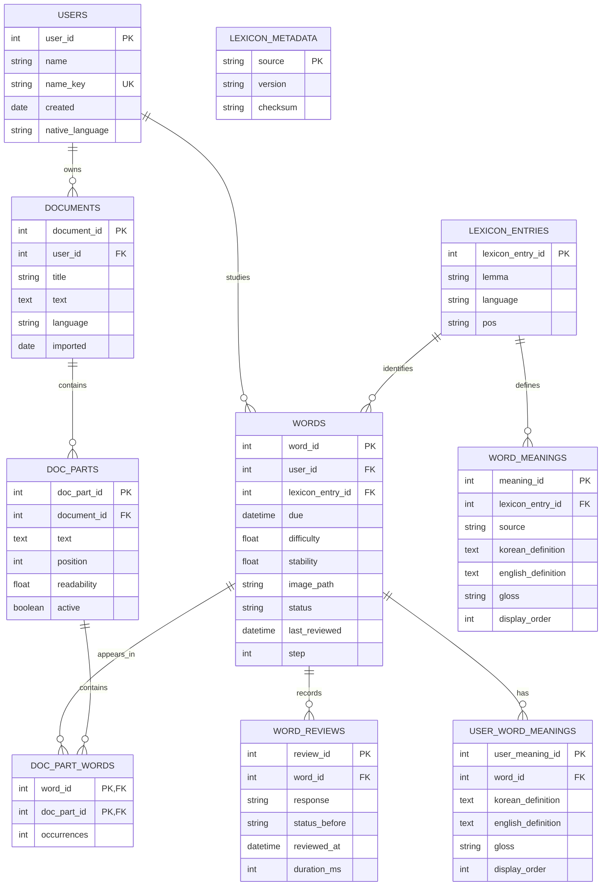

# Database Schema

```mermaid
erDiagram
    USERS {
        int user_id PK
        string name
        string name_key UK
        date created
        string native_language
    }

    DOCUMENTS {
        int document_id PK
        int user_id FK
        string title
        text text
        string language
        date imported
    }

    DOC_PARTS {
        int doc_part_id PK
        int document_id FK
        text text
        int position
        float readability
        boolean active
    }

    LEXICON_ENTRIES {
        int lexicon_entry_id PK
        string lemma
        string language
        string pos
    }

    LEXICON_METADATA {
        string source PK
        string version
        string checksum
    }

    WORDS {
        int word_id PK
        int user_id FK
        int lexicon_entry_id FK
        datetime due
        float difficulty
        float stability
        string image_path
        string status
        datetime last_reviewed
        int step
    }

    WORD_MEANINGS {
        int meaning_id PK
        int lexicon_entry_id FK
        string source
        text korean_definition
        text english_definition
        string gloss
        int display_order
    }

    WORD_REVIEWS {
        int review_id PK
        int word_id FK
        string response
        string status_before
        datetime reviewed_at
        int duration_ms
    }

    USER_WORD_MEANINGS {
        int user_meaning_id PK
        int word_id FK
        text korean_definition
        text english_definition
        string gloss
        int display_order
    }

    DOC_PART_WORDS {
        int word_id PK, FK
        int doc_part_id PK, FK
        int occurrences
    }

    USERS ||--o{ DOCUMENTS : owns
    DOCUMENTS ||--o{ DOC_PARTS : contains
    USERS ||--o{ WORDS : studies
    LEXICON_ENTRIES ||--o{ WORDS : identifies
    LEXICON_ENTRIES ||--o{ WORD_MEANINGS : defines
    WORDS ||--o{ WORD_REVIEWS : records
    WORDS ||--o{ USER_WORD_MEANINGS : has
    WORDS ||--o{ DOC_PART_WORDS : appears_in
    DOC_PARTS ||--o{ DOC_PART_WORDS : contains
```

Additional unique constraints: `(document_id, position)` in `DOC_PARTS`, `(lemma, language, pos)` in `LEXICON_ENTRIES`, and `(user_id, lexicon_entry_id)` in `WORDS`.
