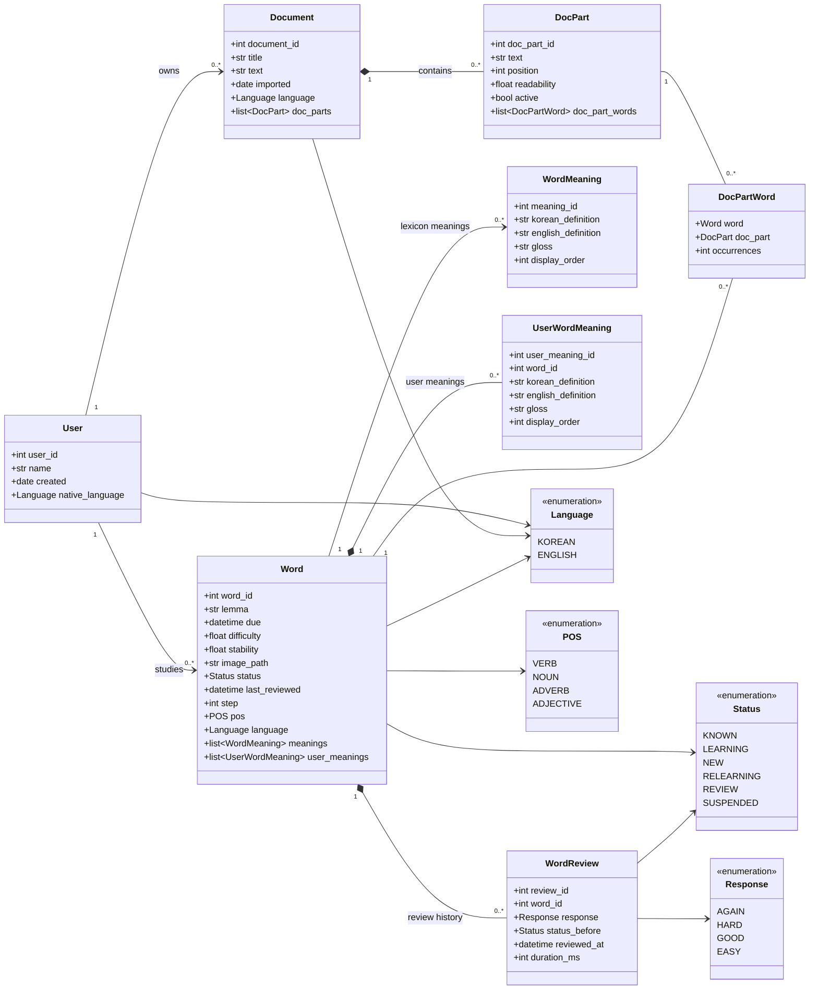

# Domain Model

```mermaid
classDiagram
    direction LR

    class User {
        +int user_id
        +str name
        +date created
        +Language native_language
    }

    class Document {
        +int document_id
        +str title
        +str text
        +date imported
        +Language language
        +list~DocPart~ doc_parts
    }

    class DocPart {
        +int doc_part_id
        +str text
        +int position
        +float readability
        +bool active
        +list~DocPartWord~ doc_part_words
    }

    class Word {
        +int word_id
        +str lemma
        +datetime due
        +float difficulty
        +float stability
        +str image_path
        +Status status
        +datetime last_reviewed
        +int step
        +POS pos
        +Language language
        +list~WordMeaning~ meanings
        +list~UserWordMeaning~ user_meanings
    }

    class WordMeaning {
        +int meaning_id
        +str korean_definition
        +str english_definition
        +str gloss
        +int display_order
    }

    class UserWordMeaning {
        +int user_meaning_id
        +int word_id
        +str korean_definition
        +str english_definition
        +str gloss
        +int display_order
    }

    class DocPartWord {
        +Word word
        +DocPart doc_part
        +int occurrences
    }

    class WordReview {
        +int review_id
        +int word_id
        +Response response
        +Status status_before
        +datetime reviewed_at
        +int duration_ms
    }

    class Language {
        <<enumeration>>
        KOREAN
        ENGLISH
    }

    class POS {
        <<enumeration>>
        VERB
        NOUN
        ADVERB
        ADJECTIVE
    }

    class Status {
        <<enumeration>>
        KNOWN
        LEARNING
        NEW
        RELEARNING
        REVIEW
        SUSPENDED
    }

    class Response {
        <<enumeration>>
        AGAIN
        HARD
        GOOD
        EASY
    }

    User "1" --> "0..*" Document : owns
    User "1" --> "0..*" Word : studies
    Document "1" *-- "0..*" DocPart : contains
    DocPart "1" -- "0..*" DocPartWord
    Word "1" -- "0..*" DocPartWord
    Word "1" --> "0..*" WordMeaning : lexicon meanings
    Word "1" *-- "0..*" UserWordMeaning : user meanings
    Word "1" *-- "0..*" WordReview : review history

    User --> Language
    Document --> Language
    Word --> Language
    Word --> POS
    Word --> Status
    WordReview --> Status
    WordReview --> Response
```
